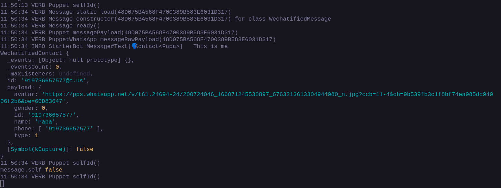

import Tabs from '@theme/Tabs'
import TabItem from '@theme/TabItem'

Automation of messages can be done easily  with wechaty onMessage function. This guide will give you a step by step overview of how to respond to self messages or messages in a room.

## Mention

Mention messages are sent automatically by the bot if the message recieved as a parameter by the onMessage belongs to a room. The bot can mention(@) others.

<Tabs
  groupId="programming-languages"
  defaultValue="ts"
  values={[
    { label: 'TypeScript',  value: 'ts', },
    { label: 'JavaScript',  value: 'js', },
    { label: 'Python',      value: 'py', },
    { label: 'Go',          value: 'go', },
    { label: 'Java',        value: 'java', },
    { label: 'PHP',         value: 'php', },
    { label: 'Scala',       value: 'scala', },
    { label: 'C#',          value: 'csharp', },
    { label: 'Rust',        value: 'rust', },
  ]
}>

<TabItem value="ts">

```ts
import { Message } from 'wechaty'

async function onMessage(message: Message): Promise<void> {
  if (await message.mentionSelf()) {
    const room = message.room()
    if (!room) {
      throw new Error('Should never reach here: a mention message must in a room')
    }

    console.info(message.text())
    // "@bot Hello"
    console.info(await message.mentionList())
    // [bot]
    console.info(await message.mentionText())
    // "Hello"

    const talker = room.talker()
    await room.say`Thanks for mention me! ${talker}`
  }
}

bot.on('message', onMessage)
```

</TabItem>
<TabItem value="js">

```js
const { Message } = require('wechaty')

async function onMessage(message) {
  if (await message.mentionSelf()) {
    const room = message.room()
    if (!room) {
      throw new Error('Should never reach here: a mention message must in a room')
    }

    console.info(message.text())
    // "@bot Hello"
    console.info(await message.mentionList())
    // [bot]
    console.info(await message.mentionText())
    // "Hello"

    const talker = room.talker()
    await room.say`Thanks for mentioning me! ${talker}`
  }
}

bot.on('message', onMessage)
```

</TabItem>
<TabItem value="py">

```py
from typing import List
from wechaty import Wechaty, Contact

class MyBot(Wechaty):
    async def on_ready(self, _):
        contacts: List[Contact] = await self.Contact.find_all()
        for contact in contacts:
            print(f'id<{contact.contact_id}>, name<{contact.name}>, type<{contact.type()}>')
```

</TabItem>
<TabItem value="go">

```go
// TODO: Pull Request is welcome!
```

</TabItem>
<TabItem value="java">

```java
// TODO: Pull Request is welcome!
```

</TabItem>
<TabItem value="php">

```php
// TODO: Pull Request is welcome!
```

</TabItem>
<TabItem value="scala">

```scala
// TODO: Pull Request is welcome!
```

</TabItem>
<TabItem value="csharp">

```csharp
// TODO: Pull Request is welcome!
```

</TabItem>
<TabItem value="rust">

```rust
// TODO: Pull Request is welcome!
```

</TabItem>
</Tabs>

The expected output of the JavaScript code is:


## Self message

Self messages are sent automatically by the bot if the message recieved as a parameter by the onMessage  function has also been sent by the bot itself.

<Tabs
  groupId="programming-languages"
  defaultValue="ts"
  values={[
    { label: 'TypeScript',  value: 'ts', },
    { label: 'JavaScript',  value: 'js', },
    { label: 'Python',      value: 'py', },
    { label: 'Go',          value: 'go', },
    { label: 'Java',        value: 'java', },
    { label: 'PHP',         value: 'php', },
    { label: 'Scala',       value: 'scala', },
    { label: 'C#',          value: 'csharp', },
    { label: 'Rust',        value: 'rust', },
  ]
}>

<TabItem value="ts">

```ts
import { Message } from 'wechaty'

async function onMessage(message: Message): Promise<void> {
  if (message.self()) {
    const talker = message.talker()
    const bot = message.wechaty.userSelf()
    assert(talker === bot, 'Message is sent from bot')
    console.info('Message is sent from bot')
  }
}

bot.on('message', onMessage)
```

</TabItem>
<TabItem value="js">

```js
const { Message } = require('wechaty')

async function onMessage (msg) {
  
  log.info('StarterBot', msg.toString())
  const contact = msg.talker() 
   console.log(contact);
  console.log("message self",msg.self());
   if (msg.self()) {
    const b = msg.wechaty.userSelf()
    assert(talker === b, 'Message is sent from bot')
    console.info('Message is sent from bot')
  }

bot.on('message', onMessage)
```

</TabItem>
<TabItem value="py">

```py
from typing import List, Optional
from wechaty import Wechaty, Contact
from wechaty_puppet.schemas.contact import ContactQueryFilter

class MyBot(Wechaty):
    async def on_ready(self, _):
        # find by id
        filehelper: Optional[Contact] = await self.Contact.find('filehelper')
        if filehelper:
            print(f'filehelper<{filehelper}>')
        
        # find by name
        contacts: List[Contact] = await self.Contact.find_all(ContactQueryFilter(name='your-friend-name'))
        print(f'total number of contacts: {len(contacts)}')

        for contact in contacts:
            print(contact)
```

</TabItem>
<TabItem value="go">

```go
// TODO: Pull Request is welcome!
```

</TabItem>
<TabItem value="java">

```java
// TODO: Pull Request is welcome!
```

</TabItem>
<TabItem value="php">

```php
// TODO: Pull Request is welcome!
```

</TabItem>
<TabItem value="scala">

```scala
// TODO: Pull Request is welcome!
```

</TabItem>
<TabItem value="csharp">

```csharp
// TODO: Pull Request is welcome!
```

</TabItem>
<TabItem value="rust">

```rust
// TODO: Pull Request is welcome!
```

</TabItem>
</Tabs>

The expected output of the JavaScript code is:

