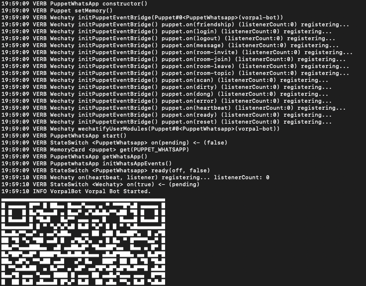

[](https://github.com/wechaty/wechaty-vorpal)
[](https://github.com/wechaty/wechaty-vorpal/actions?query=workflow%3ANPM)
[](https://www.npmjs.com/package/wechaty-vorpal)

[Vorpal](https://github.com/dthree/vorpal) is a framework for building immersive CLI applications using `Node.js`. [WechatyVorpal](https://github.com/wechaty/wechaty-vorpal) is an extensible interactive CLI plugin for Wechaty ChatOps that is powered by Vorpal.

In this tutorial, you will learn how to build a [Hacker News](https://news.ycombinator.com/) bot, that can be run on **WeChat** and **WhatsApp**, using `wechaty-vorpal` and `vorpal-hacker-news` plugins.

[](https://github.com/wechaty/wechaty-vorpal)

> Image: [rainbow sword](http://pixelartmaker.com/art/3008b950f5ab168)

[](https://github.com/Wechaty/wechaty)
[](https://www.typescriptlang.org/)

## Try out the bot

[](https://codesandbox.io/s/github/sbis04/vorpal-wechaty-hackernews/tree/main/?fontsize=12&hidenavigation=1&module=%2Fvorpal-bot.ts&theme=dark)

You can try out the **Vorpal Hacker News** chat bot using this interactive CodeSandbox.

Just scan the generated QR code with **WeChat** app, and you are ready to play with the bot!

<iframe
  class="codesandbox"
  src="https://codesandbox.io/embed/github/sbis04/vorpal-wechaty-hackernews/tree/main/?fontsize=12&hidenavigation=1&module=%2Fvorpal-bot.ts&theme=dark"
  title="vorpal-wechaty-hackernews"
  sandbox="allow-forms allow-modals allow-popups allow-same-origin allow-scripts"
></iframe>

## Requirements

1. [Node.js](https://nodejs.org/en/download) v12+
2. [Wechaty](https://github.com/wechaty/wechaty) v0.40+
3. [WechatyVorpal](https://github.com/wechaty/wechaty-vorpal) v0.2+

## Usage

```ts
import { Wechaty }        from 'wechaty'
import { WechatyVorpal }  from 'wechaty-vorpal'
const hackerNews = require('vorpal-hacker-news')

const wechaty = new Wechaty()

wechaty.use(
  WechatyVorpal({
    use: hackerNews,
  }),
)

wechaty.start()
```

See: [wechaty-vorpal-contrib](https://github.com/wechaty/wechaty-vorpal-contrib) for more Wechaty Vorpal Extension CLI for Chatbots.

## Getting started

Before getting started, make sure you have `Node.js` installed on your system. If you do not have `Node.js` installed (or have a version below 12), then you need to install the latest version of `Node.js` by following the links below:

:::note Node.js installation docs

* [Windows](https://nodejs.org/en/download/package-manager/#windows)
* [Linux\(Debian/Ubuntu\)](https://nodejs.org/en/download/package-manager/#debian-and-ubuntu-based-linux-distributions)
* [macOS](https://nodejs.org/en/download/package-manager/#macos)

> Installation guide for `Node.js` on other platforms can be found [here](https://nodejs.org/en/download/package-manager/).

:::

You can head over to the [Building the bot](#building-the-bot) section to learn how to build the bot on your own.

Otherwise, if you just want to try out the bot on your local system, follow the steps below:

### 1. Clone the repository

Use the following commands to clone the [GitHub repository](https://github.com/sbis04/vorpal-wechaty-hn) and navigate to the directory:

```bash
git clone https://github.com/sbis04/vorpal-wechaty-hn
cd vorpal-wechaty-hn
```

### 2. Install dependencies

You can install the `npm` packages required for running the bot, using this command:

```sh
npm install
```

### 3. Run the bot

First, you have to `export/set` the environment variables, and then you can run the bot:

#### Linux/macOS

```bash
export WECHATY_LOG=verbose
export WECHATY_PUPPET=wechaty-puppet-wechat
# If you want to use WhatsApp
# export WECHATY_PUPPET=wechaty-puppet-whatsapp
npm start
```

#### Windows

```bash
set WECHATY_LOG=verbose
set WECHATY_PUPPET=wechaty-puppet-wechat
# If you want to use WhatsApp
# set WECHATY_PUPPET=wechaty-puppet-whatsapp
npm start
```

> There are various **Wechaty puppets** available, you can know more about them [here](https://github.com/wechaty/wechaty-getting-started#working-with-different-puppets).

It will generate a QR code, scan it using **WeChat** or **WhatsApp** (according to the puppet you have used), and you are ready to play with the bot.

## Building the bot

Let's get started with building the Vorpal Hacker News bot using Wechaty.

### 1. Initialize project

Create a new folder called `vorpal-bot` and move into that directory:

```bash
mkdir vorpal-bot
cd vorpal-bot
```

Use the following command to initialize an npm project:

```bash
npm init -y
```

This will generate the `package.json` file containing these:

```json
{
  "name": "vorpal-bot",
  "version": "1.0.0",
  "description": "",
  "main": "index.js",
  "scripts": {
    "test": "echo \"Error: no test specified\" && exit 1"
  },
  "keywords": [],
  "author": "",
  "license": "ISC"
}
```

### 2. Add dependencies

For building the bot mainly you will require the following dependencies:

* [wechaty](https://www.npmjs.com/package/wechaty): Official Wechaty package
* [wechaty-vorpal](https://www.npmjs.com/package/wechaty-vorpal): For using Wechaty with Vorpal
* [vorpal-hacker-news](https://www.npmjs.com/package/vorpal-hacker-news): To fetch data from Hacker News API using Vorpal
* [qrcode-terminal](https://www.npmjs.com/package/qrcode-terminal): Displays the QR code

```json
"dependencies": {
  "qrcode-terminal": "^0.12.0",
  "vorpal-hacker-news": "^1.0.6",
  "wechaty": "^0.60.5",
  "wechaty-vorpal": "^0.6.12"
}
```

You will also need to add dependencies for using any [Wechaty Puppet](https://wechaty.js.org/docs/puppet-providers/) which helps to integrate Wechaty with various **instant messaging (IM) systems** (such as WeChat, Whatsapp, and Gitter):

```json
"devDependencies": {
  "wechaty-puppet-mock": "^0.28.2",
  "wechaty-puppet-wechat": "^0.28",
  "wechaty-puppet-wechat4u": "^0.18",
  "wechaty-puppet-whatsapp": "0.2.3"
}
```

> You can add only the puppets that you need for using the bot.

At this point the `package.json` file will look like this (a few more required dependencies are added):

```json
{
  "name": "vorpal-bot",
  "version": "1.0.0",
  "description": "Vorpal Hacker News Bot",
  "main": "index.js",
  "scripts": {
    "test": "echo \"Error: no test specified\" && exit 1"
  },
  "keywords": [],
  "author": "",
  "license": "ISC",
  "dependencies": {
    "qrcode-terminal": "^0.12.0",
    "vorpal-hacker-news": "^1.0.6",
    "wechaty": "^0.60.5",
    "wechaty-vorpal": "^0.6.12"
  },
  "devDependencies": {
    "@chatie/eslint-config": "^0.12.3",
    "@chatie/tsconfig": "^0.14.1",
    "check-node-version": "^4.1.0",
    "connect": "^3.7.0",
    "cross-env": "^7.0.3",
    "nodemon": "^2.0.7",
    "ts-node": "^9.1.1",
    "typescript": "^4.2.4",
    "wechaty-puppet-mock": "^0.28.2",
    "wechaty-puppet-wechat": "^0.28",
    "wechaty-puppet-wechat4u": "^0.18",
    "wechaty-puppet-whatsapp": "0.2.3"
  }
}
```

### 3. Install dependencies

Before proceeding further, you should install the dependencies that we just specified in the `package.json` file. Run the following command from the root directory:

```sh
npm install
```

This will generate a `node_modules` directory containing all the installed dependencies, and a `package-lock.json` file.

### 4. Configure TypeScript

Create a new file called `tsconfig.json` inside the root folder of the npm project directory, add the following:

```json
{
    "extends": "@chatie/tsconfig",
    "compilerOptions": {
      "outDir": "dist"
    },
    "include": [
      "src/**/*.ts"
    ],
    "exclude": [
      "node_modules/"
    ]
}
```

Now, you are ready to start writing the main code for building the bot.

### 5. Writing code for bot

Start by creating a new folder called `src`, and add a file `vorpal-bot.ts`. We will be writing the code here.

Let's import the required packages in the TypeScript file:

```ts
import {
  Contact,
  Message,
  ScanStatus,
  Wechaty,
  log,
} from 'wechaty'

import { WechatyVorpal } from 'wechaty-vorpal'
import { generate } from 'qrcode-terminal'
const hackerNews = require('vorpal-hacker-news')
```

Now, you have to define some functions that will help you to handle the different events returned by the Wechaty bot.

* **onScan**

  Function used for generating **QR code** for the puppet specified, and display it on the console.

  Follow the steps below:
  
  1. Check for the `status` of the QR code scanning process:
  
     ```ts
     function onScan(qrcode: string, status: ScanStatus) {
         if (status === ScanStatus.Waiting || status === ScanStatus.Timeout) {
             // TODO: Add QR code generation here
         } else {
             log.info('VorpalBot:', 'onScan: %s(%s)', ScanStatus[status], status)
         }
     }
     ```
  
     If the **status** is `Waiting` or `Timeout` then proceed with the QR code generation, otherwise print the scan status on console.
  
  2. Generate QR code:
  
     ```ts
     generate(qrcode, { small: true })
  
     const qrcodeImageUrl = [
       'https://wechaty.js.org/qrcode/',
       encodeURIComponent(qrcode),
     ].join('')
     ```
  
  3. Display QR code on console along with the status:
  
     ```ts
     log.info('VorpalBot:', 'onScan: %s(%s) - %s', ScanStatus[status], status, qrcodeImageUrl)
     ```

* **onLogin**

  Function for printing a log message when an user logs in to the bot. Here, a `Contact` object is passed as a parameter which is printed on the console in order to understand who has logged in.

  ```ts
  function onLogin(user: Contact) {
    log.info('VorpalBot:', '%s login', user)
  }
  ```

* **onLogout**

  Function for printing a log message along with the `Contact` object, when an user logs out of the bot.

  ```ts
  function onLogout(user: Contact) {
    log.info('VorpalBot:', '%s logout', user)
  }
  ```

* **onMessage**

  Function for printing a log message with the `Message` object received by the bot from the user on the other end.

  ```ts
  async function onMessage(msg: Message) {
    log.info('VorpalBot:', msg.toString())
  }
  ```

* **onError**

  Function for printing an error message to the console if the bot fails to start.

  ```ts
  function onError(error: Error) {
      log.error('Bot error:', error)
  }
  ```

You have completed defining all the functions required for handling various bot events. Now, provide a name to initialize the Wechaty bot:

```ts
const bot = new Wechaty({
    name: "vorpal-bot",
})
```

Assign proper function to call when an event is triggered by the bot:

```ts
bot
  .on('logout', onLogout)
  .on('login', onLogin)
  .on('scan', onScan)
  .on('message', onMessage)
  .on('error', onError)
```

Use the Wechaty Vorpal plugin to connect with the Hacker News API:

```ts
bot.use(
    WechatyVorpal({
        use: hackerNews,
    }),
)
```

Finally, use the following to start the bot:

```ts
bot.start()
    .then(() => log.info('VorpalBot', 'Vorpal Bot Started.'))
    .catch(e => log.error('VorpalBot', e))
```

### 6. Defining scripts

You have to define the script for running the bot. Add the following to your `package.json` file:

```json
"scripts": {
  "lint": "eslint \"src/*.ts\"",
  "start": "ts-node src/vorpal-bot.ts",
  "start:wechat:web": "cross-env WECHATY_LOG=verbose WECHATY_PUPPET=wechaty-puppet-wechat npm start",
  "start:wechat:padlocal": "cross-env WECHATY_LOG=verbose WECHATY_PUPPET=wechaty-puppet-padlocal npm start",
  "start:puppet:service": "cross-env WECHATY_LOG=verbose WECHATY_PUPPET=wechaty-puppet-service npm start",
  "start:whatsapp:web": "cross-env WECHATY_LOG=verbose  WECHATY_PUPPET=wechaty-puppet-whatsapp npm start",
  "test": "echo \"Error: no test specified\" && exit 1"
},
```

Here, we have specified the script in way so that the type of puppet can be passed as an environment variable.

## Running the bot

In order to run the bot, first you have to **export/set** an environment variable with the type of puppet to use and then run the bot:

### Linux/macOS

```bash
export WECHATY_LOG=verbose
export WECHATY_PUPPET=wechaty-puppet-wechat
# If you want to use WhatsApp
# export WECHATY_PUPPET=wechaty-puppet-whatsapp
npm start
```

### Windows

```bash
set WECHATY_LOG=verbose
set WECHATY_PUPPET=wechaty-puppet-wechat
# If you want to use WhatsApp
# set WECHATY_PUPPET=wechaty-puppet-whatsapp
npm start
```

This will start the bot and generate a QR code like this:



Scan it using your **WeChat** or **WhatsApp** as per the puppet you have selected, and you are ready to play with the bot!

### CodeSandbox

You can try building this bot without setting up any dev environment on your local system, just head over to this interactive **CodeSandbox** by clicking the button below:

[](https://codesandbox.io/s/github/sbis04/vorpal-wechaty-hackernews/tree/starter/?fontsize=12&hidenavigation=1&module=%2Fvorpal-bot.ts&theme=dark)

You will find various `TODO(s)`, complete them and you will have a successfully running bot (a preview of the starter project is given below):

<iframe
  class="codesandbox"
  src="https://codesandbox.io/embed/github/sbis04/vorpal-wechaty-hackernews/tree/starter/?fontsize=12&hidenavigation=1&module=%2Fvorpal-bot.ts&theme=dark"
  title="vorpal-wechaty-hackernews"
  sandbox="allow-forms allow-modals allow-popups allow-same-origin allow-scripts"
></iframe>

## Bot demonstration

After scanning the generated QR code with the help of your app, the bot will start running on your device. Now, as it finds the specified commands inside the chat it will respond automatically to it.

> **NOTE:** The bot will only respond to the messages sent by the user in the other end. One word of caution, this enables the bot globally inside your app, i.e. it will respond to messages sent by any person or within any group.


Some of the commands that you can try out with the bot are as follows:


```sh
Commands:

    help [command...]       Provides help for a given command.
    exit                    Exits application.
    hacker-news [options]   Lists the top stories on hacker news.
```


```sh
Usage: hacker-news [options]

  Lists the top stories on hacker news.

  Options:

    --help              output usage information
    -l, --length [amt]  Limits the list to a given length.
```


```sh
Pulling top 3 stories on Hacker News:

  1. Discovering Dennis Ritchies Lost Dissertation (org)
     93 points by beefhash 3 hours ago | 23 comments

  2. Updating the Git protocol for SHA-256 (net)
     81 points by chmaynard 14 hours ago | 48 comments

  3. Mac OS X Leopard and Xcode on iPad Pro (com)
     134 points by tosh 10 hours ago | 28 comments
```

## Conclusion

You have learnt to use Vorpal with Wechaty and built a Hacker News bot. Vorpal has a lot of extensions, you can find some of them [here](https://github.com/wechaty/wechaty-vorpal-contrib).

## References

* [Wechaty Getting Started](https://github.com/wechaty/wechaty-getting-started)
* [Vorpal Hacker News bot](https://github.com/sbis04/vorpal-wechaty-hackernews)
